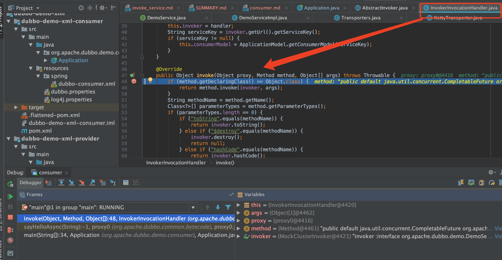
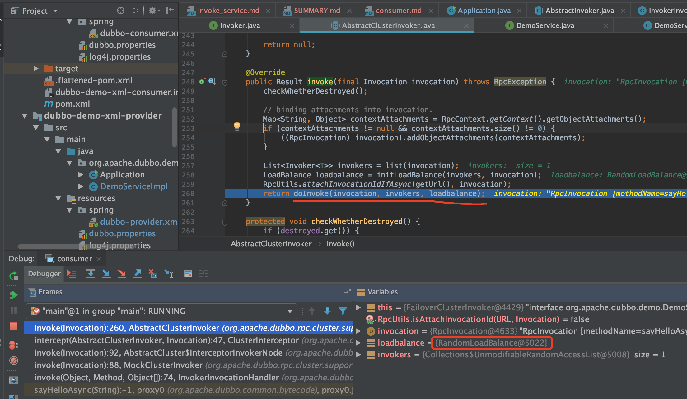
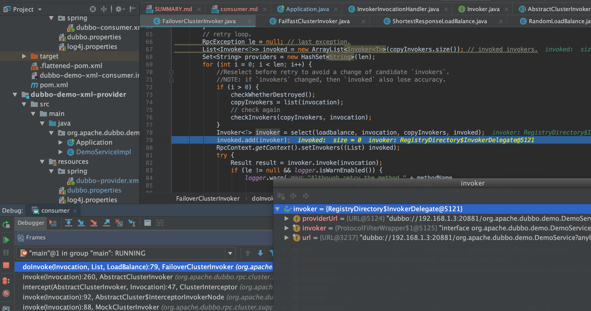
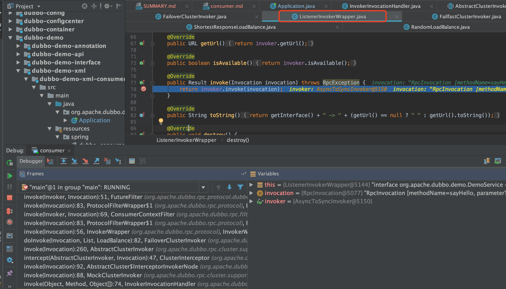
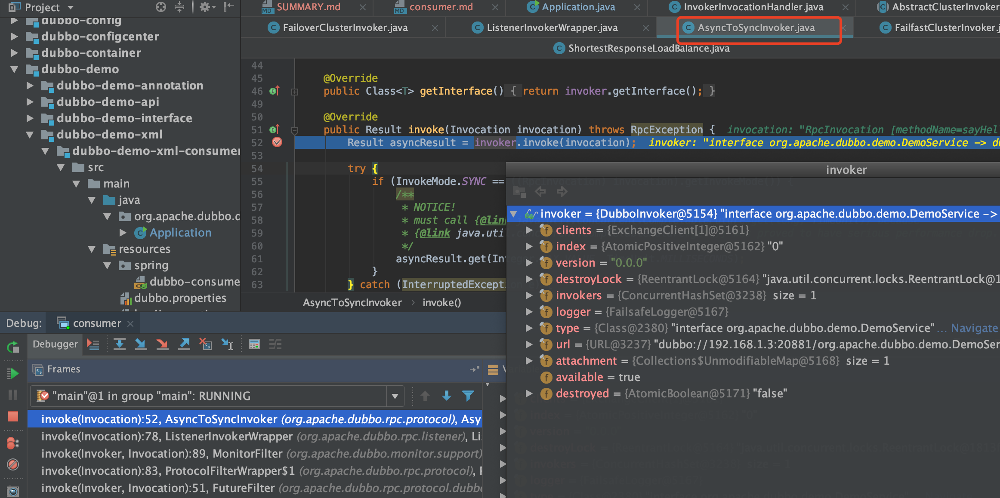
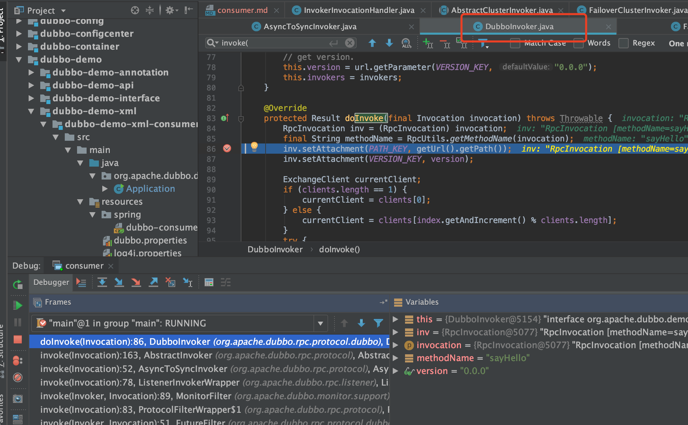
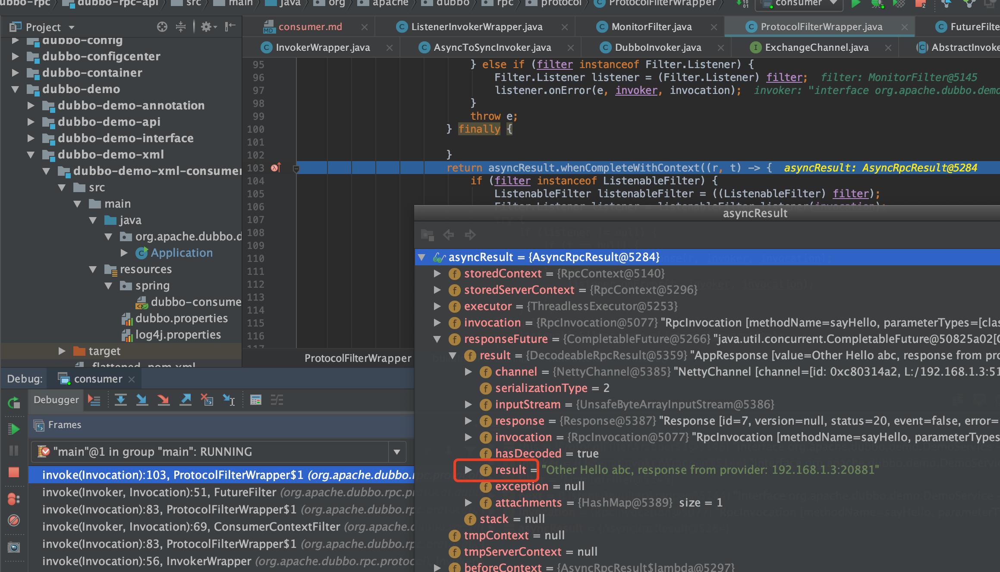

# 服务调用

## 源码流程



执行：`invoker.invoke(rpcInvocation).recreate();`

进入到`org.apache.dubbo.rpc.cluster.support.AbstractClusterInvoker#invoke`

```java
@Override
public Result invoke(final Invocation invocation) throws RpcException {
    checkWhetherDestroyed();

    // binding attachments into invocation.
    Map<String, Object> contextAttachments = RpcContext.getContext().getObjectAttachments();
    if (contextAttachments != null && contextAttachments.size() != 0) {
        ((RpcInvocation) invocation).addObjectAttachments(contextAttachments);
    }

    List<Invoker<T>> invokers = list(invocation);
    LoadBalance loadbalance = initLoadBalance(invokers, invocation);
    RpcUtils.attachInvocationIdIfAsync(getUrl(), invocation);
    return doInvoke(invocation, invokers, loadbalance);
}
```

默认`loadbalance`是`RandomLoadBalance`



服务容错，默认`FailoverClusterInvoker`

```java
public class FailoverClusterInvoker<T> extends AbstractClusterInvoker<T> {

    private static final Logger logger = LoggerFactory.getLogger(FailoverClusterInvoker.class);

    public FailoverClusterInvoker(Directory<T> directory) {
        super(directory);
    }

    @Override
    @SuppressWarnings({"unchecked", "rawtypes"})
    public Result doInvoke(Invocation invocation, final List<Invoker<T>> invokers, LoadBalance loadbalance) throws RpcException {
        List<Invoker<T>> copyInvokers = invokers;
        checkInvokers(copyInvokers, invocation);
        String methodName = RpcUtils.getMethodName(invocation);
        int len = getUrl().getMethodParameter(methodName, RETRIES_KEY, DEFAULT_RETRIES) + 1;
        if (len <= 0) {
            len = 1;
        }
        // retry loop.
        RpcException le = null; // last exception.
        List<Invoker<T>> invoked = new ArrayList<Invoker<T>>(copyInvokers.size()); // invoked invokers.
        Set<String> providers = new HashSet<String>(len);
        for (int i = 0; i < len; i++) {
            //Reselect before retry to avoid a change of candidate `invokers`.
            //NOTE: if `invokers` changed, then `invoked` also lose accuracy.
            if (i > 0) {
                checkWhetherDestroyed();
                copyInvokers = list(invocation);
                // check again
                checkInvokers(copyInvokers, invocation);
            }
            // 根据负载均衡得到执行对象
            Invoker<T> invoker = select(loadbalance, invocation, copyInvokers, invoked);
            invoked.add(invoker);
            RpcContext.getContext().setInvokers((List) invoked);
            try {
                Result result = invoker.invoke(invocation);
                if (le != null && logger.isWarnEnabled()) {
                    logger.warn("Although retry the method " + methodName
                            + " in the service " + getInterface().getName()
                            + " was successful by the provider " + invoker.getUrl().getAddress()
                            + ", but there have been failed providers " + providers
                            + " (" + providers.size() + "/" + copyInvokers.size()
                            + ") from the registry " + directory.getUrl().getAddress()
                            + " on the consumer " + NetUtils.getLocalHost()
                            + " using the dubbo version " + Version.getVersion() + ". Last error is: "
                            + le.getMessage(), le);
                }
                return result;
            } catch (RpcException e) {
                if (e.isBiz()) { // biz exception.
                    throw e;
                }
                le = e;
            } catch (Throwable e) {
                le = new RpcException(e.getMessage(), e);
            } finally {
                providers.add(invoker.getUrl().getAddress());
            }
        }
        throw new RpcException(le.getCode(), "Failed to invoke the method "
                + methodName + " in the service " + getInterface().getName()
                + ". Tried " + len + " times of the providers " + providers
                + " (" + providers.size() + "/" + copyInvokers.size()
                + ") from the registry " + directory.getUrl().getAddress()
                + " on the consumer " + NetUtils.getLocalHost() + " using the dubbo version "
                + Version.getVersion() + ". Last error is: "
                + le.getMessage(), le.getCause() != null ? le.getCause() : le);
    }

}
```





同步方法调用会进入`AsyncToSyncInvoker`





* `org.apache.dubbo.rpc.protocol.dubbo.DubboInvoker#doInvoke`

```java
@Override
protected Result doInvoke(final Invocation invocation) throws Throwable {
    RpcInvocation inv = (RpcInvocation) invocation;
    final String methodName = RpcUtils.getMethodName(invocation);
    inv.setAttachment(PATH_KEY, getUrl().getPath());
    inv.setAttachment(VERSION_KEY, version);

    ExchangeClient currentClient;
    if (clients.length == 1) {
        currentClient = clients[0];
    } else {
        currentClient = clients[index.getAndIncrement() % clients.length];
    }
    try {
        boolean isOneway = RpcUtils.isOneway(getUrl(), invocation);
        int timeout = calculateTimeout(invocation, methodName);
        if (isOneway) {
            boolean isSent = getUrl().getMethodParameter(methodName, Constants.SENT_KEY, false);
            currentClient.send(inv, isSent);
            return AsyncRpcResult.newDefaultAsyncResult(invocation);
        } else {
            ExecutorService executor = getCallbackExecutor(getUrl(), inv);
            // 发起网络请求，获取结果
            CompletableFuture<AppResponse> appResponseFuture =
                    currentClient.request(inv, timeout, executor).thenApply(obj -> (AppResponse) obj);
            // save for 2.6.x compatibility, for example, TraceFilter in Zipkin uses com.alibaba.xxx.FutureAdapter
            FutureContext.getContext().setCompatibleFuture(appResponseFuture);
            AsyncRpcResult result = new AsyncRpcResult(appResponseFuture, inv);
            result.setExecutor(executor);
            return result;
        }
    } catch (TimeoutException e) {
        throw new RpcException(RpcException.TIMEOUT_EXCEPTION, "Invoke remote method timeout. method: " + invocation.getMethodName() + ", provider: " + getUrl() + ", cause: " + e.getMessage(), e);
    } catch (RemotingException e) {
        throw new RpcException(RpcException.NETWORK_EXCEPTION, "Failed to invoke remote method: " + invocation.getMethodName() + ", provider: " + getUrl() + ", cause: " + e.getMessage(), e);
    }
}
```

最后得到返回结果


