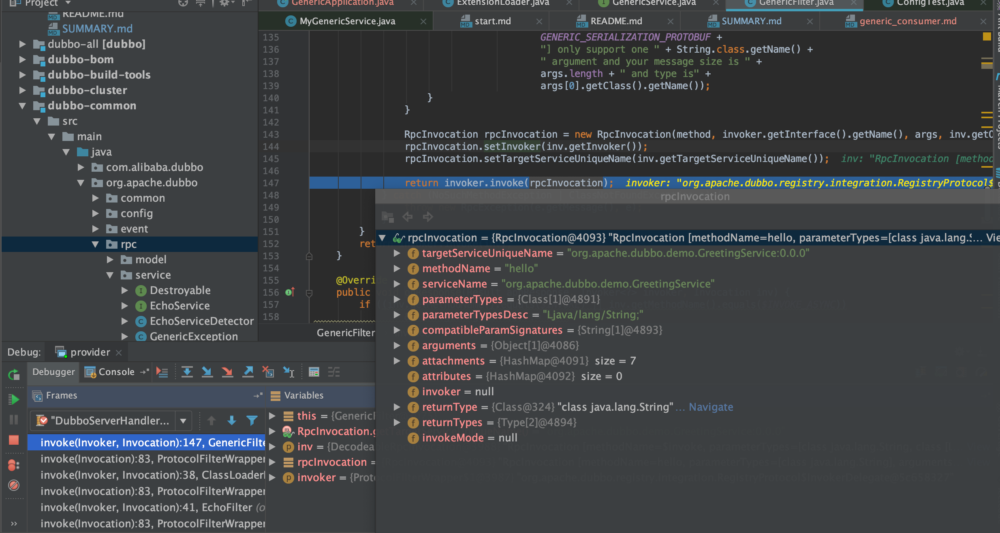

# 泛化调用

## dubbo 泛化调用客户端例子代码

服务端暴露泛化服务，客户端不需要做声明和jar引入，直接完成对特定泛化服务的调用

```java
import org.apache.dubbo.config.ApplicationConfig;
import org.apache.dubbo.config.ReferenceConfig;
import org.apache.dubbo.config.RegistryConfig;
import org.apache.dubbo.config.utils.ReferenceConfigCache;
import org.apache.dubbo.rpc.service.GenericService;

public class GenericApplication {

    public static void main(String[] args) {

        // 连接注册中心配置
        RegistryConfig registry = new RegistryConfig();
        registry.setAddress("zookeeper://127.0.0.1:2181");

        ReferenceConfig<GenericService> reference = new ReferenceConfig();

        ApplicationConfig application = new ApplicationConfig();
        application.setName("generic-consumer");
        reference.setApplication(application);
        reference.setRegistry(registry);
        reference.setInterface("org.apache.dubbo.demo.GreetingService");
        // 声明为泛化接口
        reference.setGeneric(true);

        ReferenceConfigCache cache = ReferenceConfigCache.getCache();
        GenericService genericService = cache.get(reference);

        // 直接调用
        Object result = genericService.$invoke("hello", new String[] { "java.lang.String" },
                new Object[] { "world" });
        System.out.println(result);
    }

}
```

## 什么是泛化调用

相对于需要依赖业务客户端JAR包的正常调用，泛化调用不需要依赖二方包，使用其特定的GenericService接口，传入需要调用的方法名、方法签名和参数值进行调用服务。 泛化调用适用于一些网关应用（没办法依赖所有服务的二方包）

## 泛化调用原理

客户端数据dubbo协议传递到服务端，服务端`GenericFilter`要完成实际的方法名，参数类型，参数的提取并反序列化城POJO对对象，并做各种校验工作



最后仍然是代理+反射完成实际方法调用和返回
