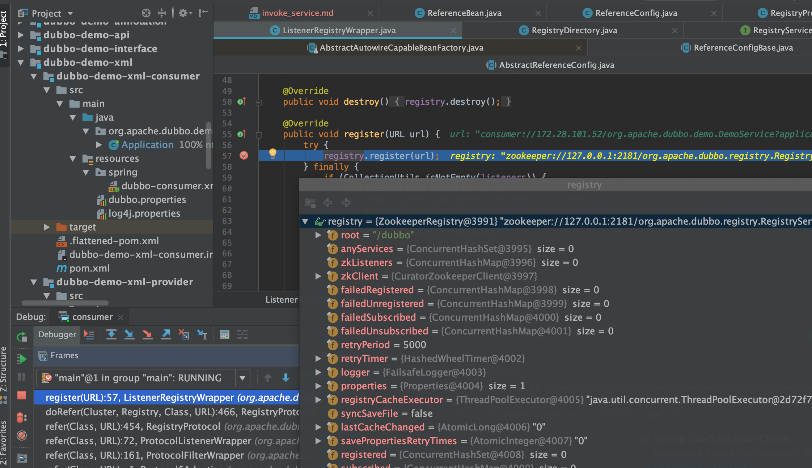
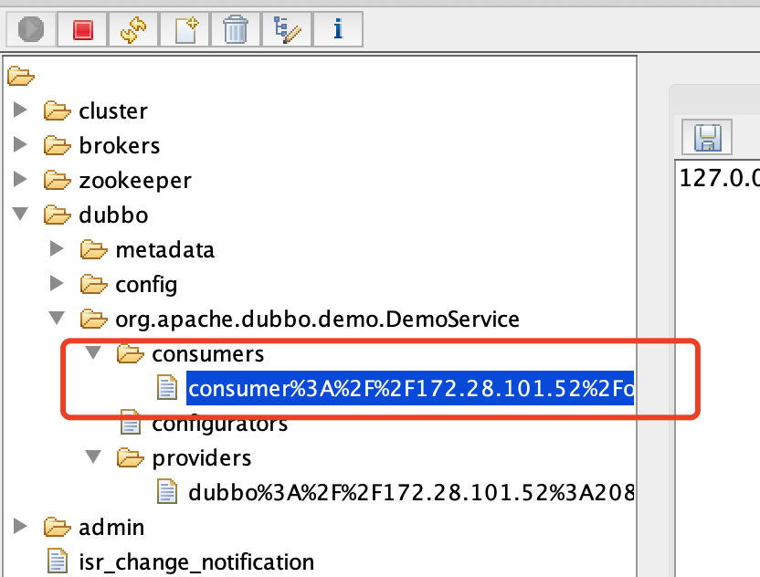
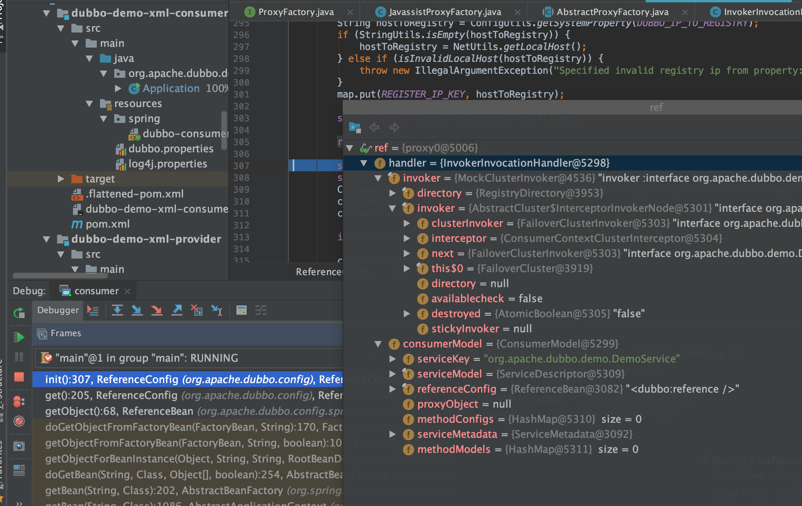
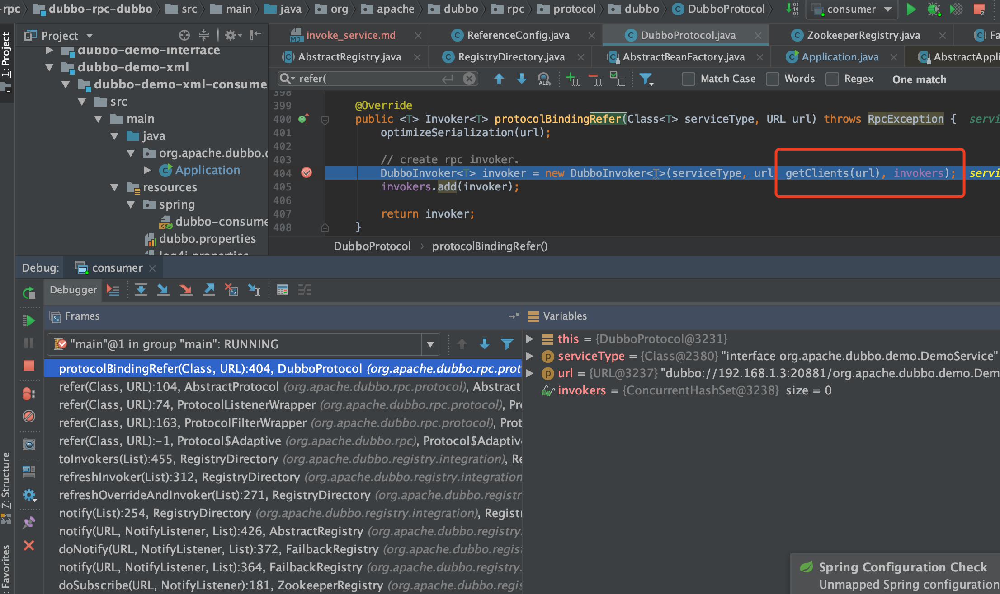
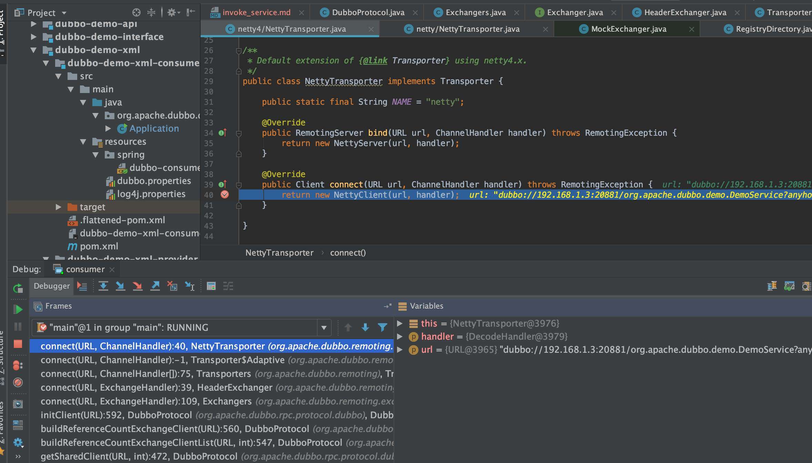
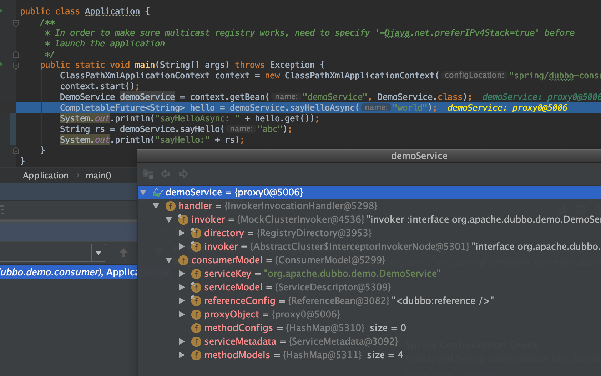

# 服务引用(消费者启动)

服务引用的目的：`服务消费者`向注册中心订阅`服务提供者`提供的服务地址，并生成服务接口的实际代理对象。

1. 把服务引用的信息封装成URL并注册到zk注册中心;  
2. 监听注册中心的服务的上下线;
3. 连接服务提供端，创建NettyClient对象;
4. 将这些信息包装成`DubboInvoker`消费端的调用链，创建消费端Invoker实例的服务代理并返回;  

## 源码走读

* `org.apache.dubbo.config.spring.schema.DubboNamespaceHandler#init`

* `org.apache.dubbo.config.ReferenceConfig#createProxy`


* `org.apache.dubbo.registry.integration.RegistryProtocol#refer`

`org.apache.dubbo.registry.integration.RegistryProtocol.doRefer`

```java
private <T> Invoker<T> doRefer(Cluster cluster, Registry registry, Class<T> type, URL url) {

    //构建RegistryDirectory,可以把它理解为注册资源,其中包含了消费者/服务/路由等相关信息
    //其同时也是回调监听器
    RegistryDirectory<T> directory = new RegistryDirectory<T>(type, url);
    directory.setRegistry(registry);
    directory.setProtocol(protocol);
    URL subscribeUrl = new URL(Constants.CONSUMER_PROTOCOL, NetUtils.getLocalHost(), 0, type.getName(), directory.getUrl().getParameters());
    if (!Constants.ANY_VALUE.equals(url.getServiceInterface())
            && url.getParameter(Constants.REGISTER_KEY, true)) {

        //向注册中心注册服务消费者
        registry.register(subscribeUrl.addParameters(Constants.CATEGORY_KEY, Constants.CONSUMERS_CATEGORY,
                Constants.CHECK_KEY, String.valueOf(false)));
    }

    // 从注册中心订阅服务提供者（即引用的服务）
    directory.subscribe(subscribeUrl.addParameter(Constants.CATEGORY_KEY,
            Constants.PROVIDERS_CATEGORY
                    + "," + Constants.CONFIGURATORS_CATEGORY
                    + "," + Constants.ROUTERS_CATEGORY));
    //
    return cluster.join(directory);
}
```

url:`consumer://172.28.101.52/org.apache.dubbo.demo.DemoService?application=demo-consumer&category=consumers&check=false&dubbo=2.0.2&init=false&interface=org.apache.dubbo.demo.DemoService&metadata-type=remote&methods=sayHello,sayHelloAsync&pid=75487&qos.port=33333&side=consumer&sticky=false&timestamp=1606215560930`



zk上可以看到注册的consumer



* `org.apache.dubbo.registry.integration.RegistryDirectory#subscribe`

注册监听服务

* `org.apache.dubbo.rpc.proxy.javassist.JavassistProxyFactory#getProxy`

创建代理

```java
public class JavassistProxyFactory extends AbstractProxyFactory {

    @Override
    @SuppressWarnings("unchecked")
    public <T> T getProxy(Invoker<T> invoker, Class<?>[] interfaces) {
        return (T) Proxy.getProxy(interfaces).newInstance(new InvokerInvocationHandler(invoker));
    }

    @Override
    public <T> Invoker<T> getInvoker(T proxy, Class<T> type, URL url) {
        // TODO Wrapper cannot handle this scenario correctly: the classname contains '$'
        final Wrapper wrapper = Wrapper.getWrapper(proxy.getClass().getName().indexOf('$') < 0 ? proxy.getClass() : type);
        return new AbstractProxyInvoker<T>(proxy, type, url) {
            @Override
            protected Object doInvoke(T proxy, String methodName,
                                      Class<?>[] parameterTypes,
                                      Object[] arguments) throws Throwable {
                return wrapper.invokeMethod(proxy, methodName, parameterTypes, arguments);
            }
        };
    }

}
```



* `org.apache.dubbo.rpc.protocol.dubbo.DubboProtocol#protocolBindingRefer`



建立连接

```java
 /**
 * Create new connection
 *
 * @param url
 */
private ExchangeClient initClient(URL url) {

    // client type setting.
    String str = url.getParameter(CLIENT_KEY, url.getParameter(SERVER_KEY, DEFAULT_REMOTING_CLIENT));

    url = url.addParameter(CODEC_KEY, DubboCodec.NAME);
    // enable heartbeat by default
    url = url.addParameterIfAbsent(HEARTBEAT_KEY, String.valueOf(DEFAULT_HEARTBEAT));

    // BIO is not allowed since it has severe performance issue.
    if (str != null && str.length() > 0 && !ExtensionLoader.getExtensionLoader(Transporter.class).hasExtension(str)) {
        throw new RpcException("Unsupported client type: " + str + "," +
                " supported client type is " + StringUtils.join(ExtensionLoader.getExtensionLoader(Transporter.class).getSupportedExtensions(), " "));
    }

    ExchangeClient client;
    try {
        // connection should be lazy
        if (url.getParameter(LAZY_CONNECT_KEY, false)) {
            client = new LazyConnectExchangeClient(url, requestHandler);

        } else {
            client = Exchangers.connect(url, requestHandler);
        }

    } catch (RemotingException e) {
        throw new RpcException("Fail to create remoting client for service(" + url + "): " + e.getMessage(), e);
    }

    return client;
}
```

进入`org.apache.dubbo.remoting.exchange.support.header.HeaderExchanger#connect`

接着进入`org.apache.dubbo.remoting.Transporters#connect`

```java
public static Client connect(URL url, ChannelHandler... handlers) throws RemotingException {
    if (url == null) {
        throw new IllegalArgumentException("url == null");
    }
    ChannelHandler handler;
    if (handlers == null || handlers.length == 0) {
        handler = new ChannelHandlerAdapter();
    } else if (handlers.length == 1) {
        handler = handlers[0];
    } else {
        handler = new ChannelHandlerDispatcher(handlers);
    }
    return getTransporter().connect(url, handler);
}
```



最终得到的是代理对象


