# 服务导出

## dubbo 服务导出

Dubbo 服务导出过程始于 Spring 容器发布刷新事件，Dubbo 在接收到事件后，会立即执行服务导出逻辑。整个逻辑大致可分为三个部分
* 第一部分是前置工作，主要用于检查参数，组装 URL。
* 第二部分是导出服务，包含导出服务到本地 (JVM)，和导出服务到远程两个过程。
* 第三部分是向注册中心注册服务，用于服务发现。

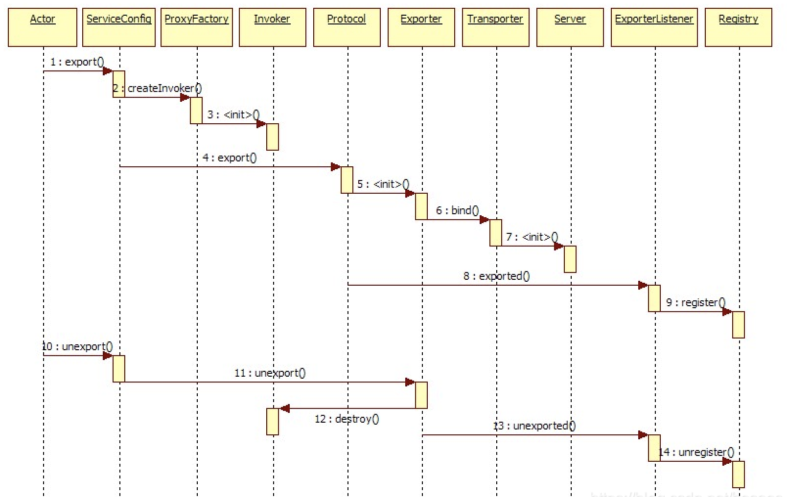

## 服务怎么导出的？

dubbo会在Spring实例化bean之后，在刷新容器最后一步发布`ContextRefreshEvent`事件的时候，通知实现了`ApplicationListener`的`ServiceBean`类进行回调`onApplicationEvent`事件方法，dubbo会在这个方法中调用`ServiceBean`父类`ServiceConfig`的`export`方法，该方法真正实现服务的(异步或者非异步)发布

* 暴露本地服务
* 暴露远程服务
* 启动netty
* 连接zookeeper
* 到zookeeper注册
* 监听zookeeper

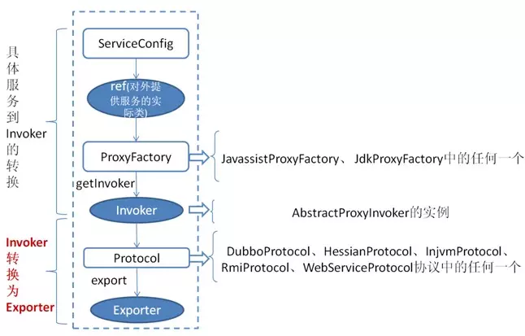

* 首先 ServiceConfig 类拿到对外提供服务的实际类 ref(如：HelloWorldImpl),然后通过 ProxyFactory 类的 getInvoker方法使用 ref 生成一个 AbstractProxyInvoker 实例，到这一步就完成具体服务到 Invoker 的转化。
* 接下来就是 Invoker 转换到 Exporter 的过程。Dubbo 处理服务暴露的关键就在 Invoker 转换到 Exporter 的过程，上图中的红色部分。
    * Dubbo 的实现  Dubbo 协议的 Invoker 转为 Exporter 发生在 DubboProtocol 类的 export 方法，它主要是打开 socket 侦听服务，并接收客户端发来的各种请求，通讯细节由 Dubbo 自己实现。

## 源码导出流程图

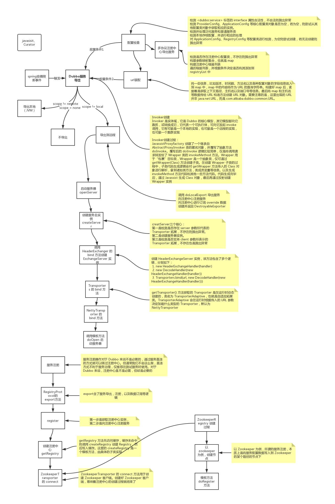

## 源码走读

`DubboBeanDefinitionParser implements BeanDefinitionParser`解析xml中的dubbo标签，生成`BeanDefinition`

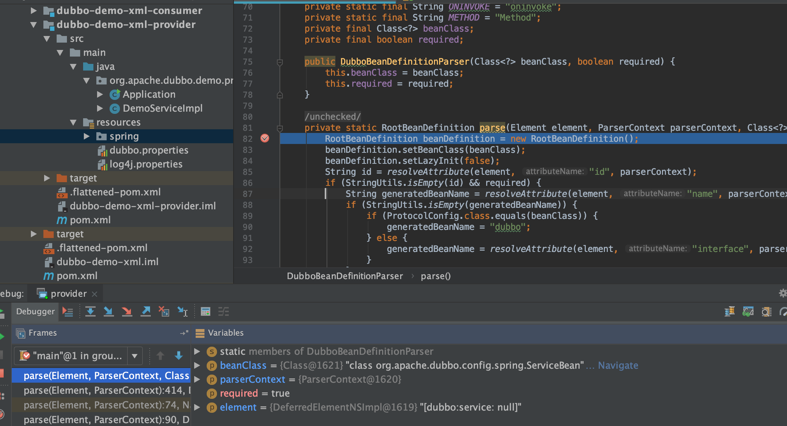

`org.apache.dubbo.config.spring.schema.DubboNamespaceHandler`

注解方式则是`ServiceClassPostProcessor`类负责将带有`org.apache.dubbo.config.annotation.Service`注解的类注册为普通的 bean 和 ServiceBean

```java
public class ServiceClassPostProcessor implements BeanDefinitionRegistryPostProcessor, EnvironmentAware,
        ResourceLoaderAware, BeanClassLoaderAware {
```


### ServiceBean 发布事件

```java
public class ServiceBean<T> extends ServiceConfig<T> implements InitializingBean, DisposableBean,
        ApplicationContextAware, BeanNameAware, ApplicationEventPublisherAware {
```

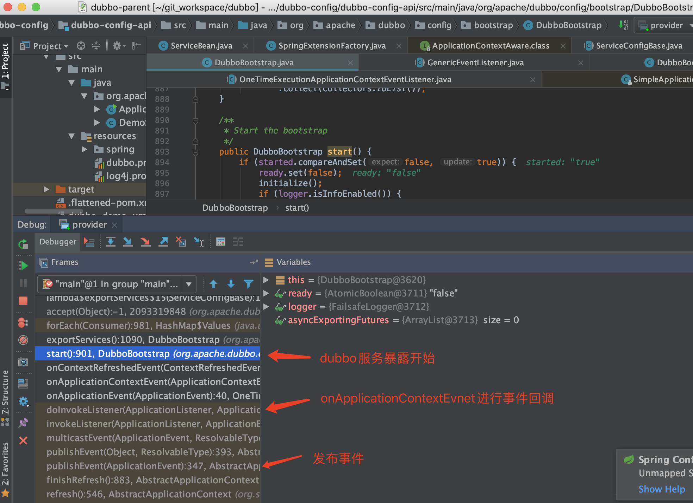

在ServiceBean发布了`ServiceBeanExportedEvent`事件

```java
public class ServiceBeanExportedEvent extends ApplicationEvent {

    /**
     * Create a new ApplicationEvent.
     *
     * @param serviceBean {@link ServiceBean} bean
     */
    public ServiceBeanExportedEvent(ServiceBean serviceBean) {
        super(serviceBean);
    }

    /**
     * Get {@link ServiceBean} instance
     *
     * @return non-null
     */
    public ServiceBean getServiceBean() {
        return (ServiceBean) super.getSource();
    }
}
```

* ServiceConfig导出服务

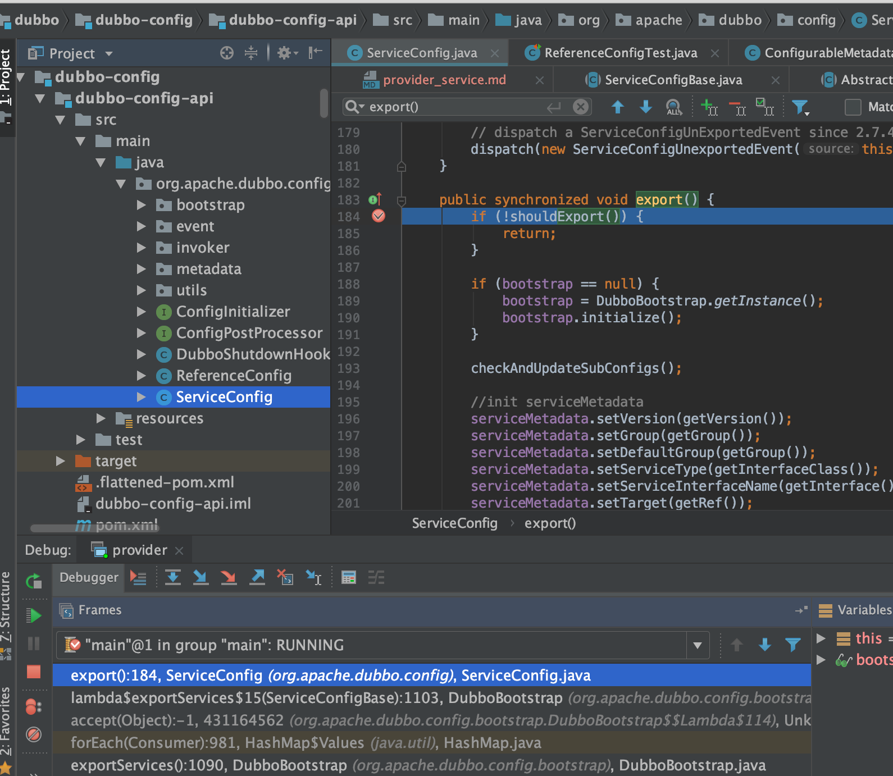

* `org.apache.dubbo.config.ServiceConfig#doExportUrls`

定义了多少个协议，就导出多少次，可以向多个注册中心注册

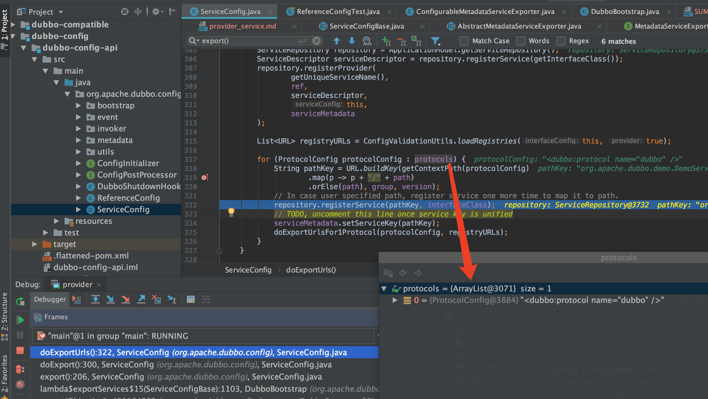

导出到哪里，比如zookeeper，如下可以到registry

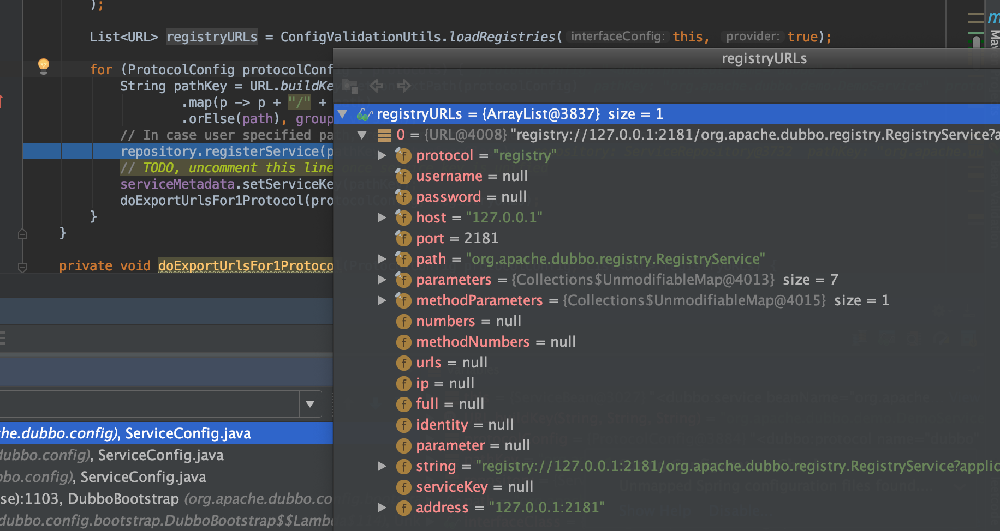

导出本地缓存

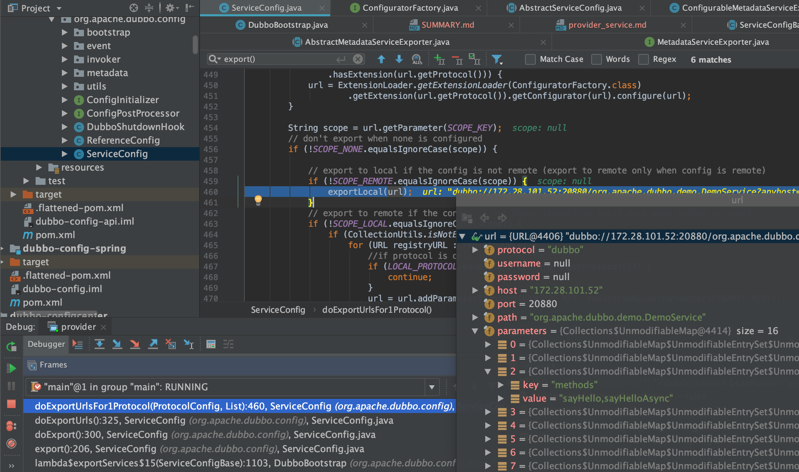

导出远程zk，代理

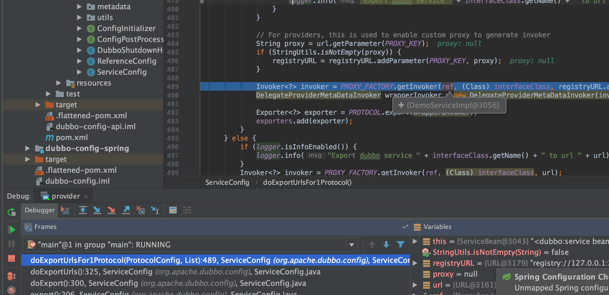

```java
Invoker<?> invoker = PROXY_FACTORY.getInvoker(ref, (Class) interfaceClass, registryURL.addParameterAndEncoded(EXPORT_KEY, url.toFullString()));
DelegateProviderMetaDataInvoker wrapperInvoker = new DelegateProviderMetaDataInvoker(invoker, this);

Exporter<?> exporter = PROTOCOL.export(wrapperInvoker);
exporters.add(exporter);
```

* `PROTOCOL.export(wrapperInvoker)`走到 `org.apache.dubbo.registry.integration.RegistryProtocol#export`

```java
//export invoker
final ExporterChangeableWrapper<T> exporter = doLocalExport(originInvoker, providerUrl);
```

* 继续走到`org.apache.dubbo.rpc.protocol.dubbo.DubboProtocol#export`

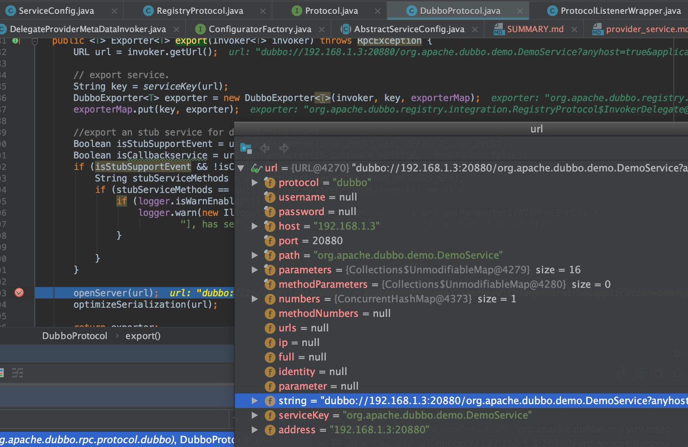

需要创建服务`createServer(url)`

```java
private void openServer(URL url) {
    // find server.
    String key = url.getAddress();
    //client can export a service which's only for server to invoke
    boolean isServer = url.getParameter(IS_SERVER_KEY, true);
    if (isServer) {
        ProtocolServer server = serverMap.get(key);
        if (server == null) {
            synchronized (this) {
                server = serverMap.get(key);
                if (server == null) {
                    serverMap.put(key, createServer(url));
                }
            }
        } else {
            // server supports reset, use together with override
            server.reset(url);
        }
    }
}
```

* `createServer`默认netty

url: `dubbo://192.168.1.3:20880/org.apache.dubbo.demo.DemoService?anyhost=true&application=demo-provider&bind.ip=192.168.1.3&bind.port=20880&channel.readonly.sent=true&codec=dubbo&deprecated=false&dubbo=2.0.2&dynamic=true&generic=false&heartbeat=60000&interface=org.apache.dubbo.demo.DemoService&metadata-type=remote&methods=sayHello,sayHelloAsync&pid=70345&qos.port=22222&release=&side=provider&timestamp=1606142890163`

```java
private ProtocolServer createServer(URL url) {
    url = URLBuilder.from(url)
            // send readonly event when server closes, it's enabled by default
            .addParameterIfAbsent(CHANNEL_READONLYEVENT_SENT_KEY, Boolean.TRUE.toString())
            // enable heartbeat by default
            .addParameterIfAbsent(HEARTBEAT_KEY, String.valueOf(DEFAULT_HEARTBEAT))
            .addParameter(CODEC_KEY, DubboCodec.NAME)
            .build();
    String str = url.getParameter(SERVER_KEY, DEFAULT_REMOTING_SERVER);

    if (str != null && str.length() > 0 && !ExtensionLoader.getExtensionLoader(Transporter.class).hasExtension(str)) {
        throw new RpcException("Unsupported server type: " + str + ", url: " + url);
    }

    ExchangeServer server;
    try {
        server = Exchangers.bind(url, requestHandler);
    } catch (RemotingException e) {
        throw new RpcException("Fail to start server(url: " + url + ") " + e.getMessage(), e);
    }

    str = url.getParameter(CLIENT_KEY);
    if (str != null && str.length() > 0) {
        Set<String> supportedTypes = ExtensionLoader.getExtensionLoader(Transporter.class).getSupportedExtensions();
        if (!supportedTypes.contains(str)) {
            throw new RpcException("Unsupported client type: " + str);
        }
    }

    return new DubboProtocolServer(server);
}
```

开始绑定

```java
public static ExchangeServer bind(URL url, ExchangeHandler handler) throws RemotingException {
    if (url == null) {
        throw new IllegalArgumentException("url == null");
    }
    if (handler == null) {
        throw new IllegalArgumentException("handler == null");
    }
    url = url.addParameterIfAbsent(Constants.CODEC_KEY, "exchange");
    return getExchanger(url).bind(url, handler);
}
```

走到`org.apache.dubbo.remoting.Transporters#bind`

```java
public static RemotingServer bind(URL url, ChannelHandler... handlers) throws RemotingException {
    if (url == null) {
        throw new IllegalArgumentException("url == null");
    }
    if (handlers == null || handlers.length == 0) {
        throw new IllegalArgumentException("handlers == null");
    }
    ChannelHandler handler;
    if (handlers.length == 1) {
        handler = handlers[0];
    } else {
        handler = new ChannelHandlerDispatcher(handlers);
    }
    return getTransporter().bind(url, handler);
}
```

* 最后使用netty服务

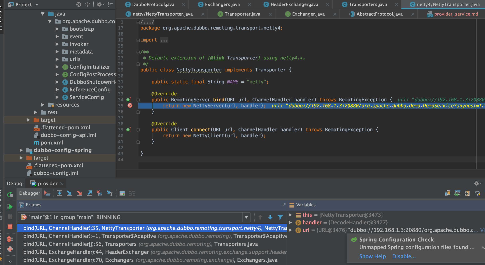

## telnet 服务调用

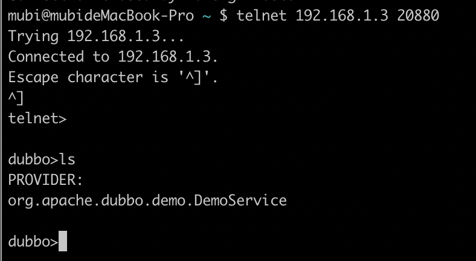

```java
mubi@mubideMacBook-Pro ~ $ telnet 192.168.1.3 20880
Trying 192.168.1.3...
Connected to 192.168.1.3.
Escape character is '^]'.
^]
telnet>

dubbo>ls
PROVIDER:
org.apache.dubbo.demo.DemoService

dubbo>ls org.apache.dubbo.demo.DemoService
org.apache.dubbo.demo.DemoService (as provider):
	sayHello
	sayHelloAsync

dubbo>invoke org.apache.dubbo.demo.DemoService.sayHello('aaa')
Use default service org.apache.dubbo.demo.DemoService.
result: "Hello aaa, response from provider: null"
elapsed: 1014 ms.
dubbo>
```

## dubbo服务本地发布，远程发布的原因

为什么会有本地暴露和远程暴露呢?不从场景考虑讨论技术的没有意义是.在dubbo中我们一个服务可能既是Provider,又是Consumer,因此就存在他自己调用自己服务的情况,如果再通过网络去访问,那自然是舍近求远,因此他是有本地暴露服务的这个设计.从这里我们就知道这个两者的区别

* 本地暴露是暴露在JVM中,不需要网络通信
* 远程暴露是将ip,端口等信息暴露给远程客户端,调用时需要网络通信

如果协议为本地协议(injvm)，则表示不向注册中心注册服务，在map中存储键为notify,值为false,表示当注册中心监听到服务提供者发送变化（服务提供者增加、服务提供者减少等事件）时不通知。
