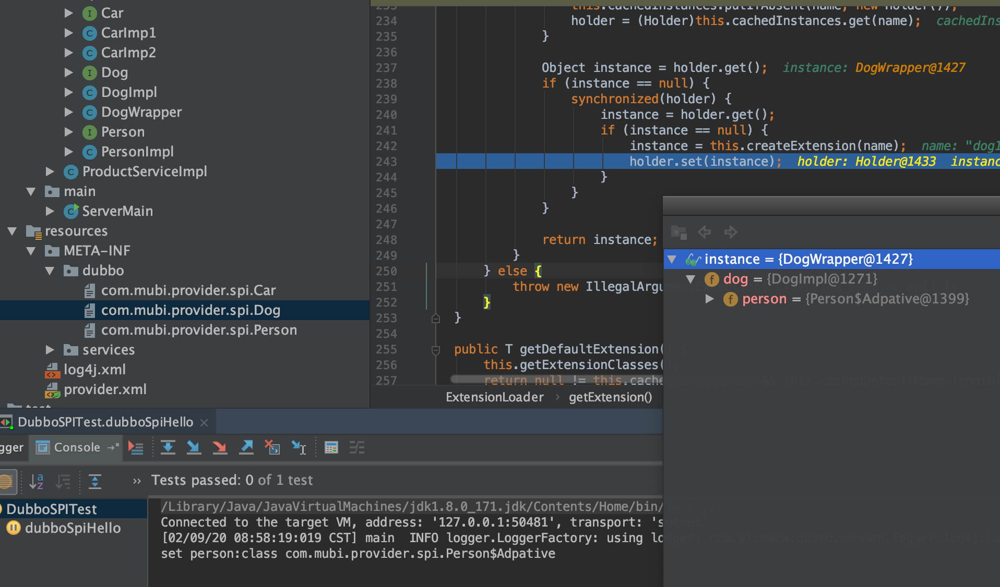

# dubbo基础

<a href='https://dubbo.apache.org/zh/docs/v2.7/dev/source/'>Dubbo 源代码分析系列</a>

## dubbo框架


* 服务接口层（Service）：该层是与实际业务逻辑相关的，根据服务提供方和服务消费方的业务设计对应的接口和实现。
* 配置层（Config）：对外配置接口，以ServiceConfig和ReferenceConfig为中心，可以直接new配置类，也可以通过spring解析配置生成配置类。
* 服务代理层（Proxy）：服务接口透明**代理**，生成服务的客户端Stub和服务器端Skeleton，以ServiceProxy为中心，扩展接口为ProxyFactory。
* 服务注册层（Registry）：封装服务地址的注册与发现，以服务URL为中心，扩展接口为RegistryFactory、Registry和RegistryService。可能没有服务注册中心，此时服务提供方直接暴露服务。
* 集群层（Cluster）：封装多个提供者的路由及**负载均衡**，并桥接注册中心，以Invoker为中心，扩展接口为Cluster、Directory、Router和LoadBalance。将多个服务提供方组合为一个服务提供方，实现对服务消费方来透明，只需要与一个服务提供方进行交互。
* 监控层（Monitor）：RPC调用次数和调用时间监控，以Statistics为中心，扩展接口为MonitorFactory、Monitor和MonitorService。
* 远程调用层（Protocol）：封将RPC调用，以Invocation和Result为中心，扩展接口为Protocol、Invoker和Exporter。Protocol是服务域，它是Invoker暴露和引用的主功能入口，它负责Invoker的生命周期管理。Invoker是实体域，它是Dubbo的核心模型，其它模型都向它靠扰，或转换成它，它代表一个可执行体，可向它发起invoke调用，它有可能是一个本地的实现，也可能是一个远程的实现，也可能一个集群实现。
* 信息交换层（Exchange）：封装请求响应模式，同步转异步，以Request和Response为中心，扩展接口为Exchanger、ExchangeChannel、ExchangeClient和ExchangeServer。
* 网络传输层（Transport）：抽象mina和netty为统一接口，以Message为中心，扩展接口为Channel、Transporter、Client、Server和Codec。
* 数据序列化层（Serialize）：可复用的一些工具，扩展接口为Serialization、 ObjectInput、ObjectOutput和ThreadPool。

## 调用链 & 领域模型


在 Dubbo 的核心领域模型中：

* Protocol 是服务域，它是 Invoker 暴露和引用的主功能入口，它负责 Invoker 的生命周期管理。
* Invoker 是实体域，它是 Dubbo 的核心模型，其它模型都向它靠扰，或转换成它，它代表一个可执行体，可向它发起 invoke 调用，它有可能是一个本地的实现，也可能是一个远程的实现，也可能一个集群实现。
* Invocation 是会话域，它持有调用过程中的变量，比如方法名，参数等。

## dubbo源码模拟

<a href='https://github.com/doctording/dubbo-study'>https://github.com/doctording/dubbo-study</a>

## SPI

<a href="https://dubbo.apache.org/zh-cn/docs/source_code_guide/dubbo-spi.html">dubbo spi文档</a>

SPI 全称为 Service Provider Interface，是一种服务发现机制。SPI 的本质是将接口实现类的全限定名配置在文件中，并由服务加载器读取配置文件，加载实现类。这样可以在运行时，动态为接口替换实现类。正因此特性，我们可以很容易的通过 SPI 机制为我们的程序提供拓展功能。SPI 机制在第三方框架中也有所应用，比如 Dubbo 就是通过 SPI 机制加载所有的组件。不过，Dubbo 并未使用 Java 原生的 SPI 机制，而是对其进行了增强，使其能够更好的满足需求。在 Dubbo 中，SPI 是一个非常重要的模块。基于 SPI，我们可以很容易的对 Dubbo 进行拓展。

SPI可以理解为：是"基于接口的编程 + 策略模式 + 配置文件"组合实现的动态加载机制

Dubbo 并未使用 Java SPI，而是重新实现了一套功能更强的 SPI 机制。Dubbo SPI的相关逻辑被封装在了`ExtensionLoader`类中，通过 ExtensionLoader，我们可以加载指定的实现类，使用如下

```java
public class DubboSPITest {

    @Test
    public void sayHello() throws Exception {
        ExtensionLoader<Robot> extensionLoader =
            ExtensionLoader.getExtensionLoader(Robot.class);
        Robot optimusPrime = extensionLoader.getExtension("optimusPrime");
        optimusPrime.sayHello();
        Robot bumblebee = extensionLoader.getExtension("bumblebee");
        bumblebee.sayHello();
    }
}
```

* META-INF/dubbo

```java
optimusPrime = org.apache.spi.OptimusPrime
bumblebee = org.apache.spi.Bumblebee
```

* 首先通过 ExtensionLoader 的 getExtensionLoader 方法获取一个 ExtensionLoader 实例（接口的ExtensionLoader对象）
* 然后再通过 ExtensionLoader 的 getExtension 方法获取拓展类对象（接口的某个具体实现类实例，主要通过<font color='red'>反射</font>实现）

```java
private T createExtension(String name) {
    // 从配置文件中加载所有的拓展类，可得到“配置项名称”到“配置类”的映射关系表
    Class<?> clazz = getExtensionClasses().get(name);
    if (clazz == null) {
        throw findException(name);
    }
    try {
        T instance = (T) EXTENSION_INSTANCES.get(clazz);
        if (instance == null) {
            // 通过反射创建实例
            EXTENSION_INSTANCES.putIfAbsent(clazz, clazz.newInstance());
            instance = (T) EXTENSION_INSTANCES.get(clazz);
        }
        // 向实例中注入依赖
        injectExtension(instance);
        Set<Class<?>> wrapperClasses = cachedWrapperClasses;
        if (wrapperClasses != null && !wrapperClasses.isEmpty()) {
            // 循环创建 Wrapper 实例
            for (Class<?> wrapperClass : wrapperClasses) {
                // 将当前 instance 作为参数传给 Wrapper 的构造方法，并通过反射创建 Wrapper 实例。
                // 然后向 Wrapper 实例中注入依赖，最后将 Wrapper 实例再次赋值给 instance 变量
                instance = injectExtension(
                    (T) wrapperClass.getConstructor(type).newInstance(instance));
            }
        }
        return instance;
    } catch (Throwable t) {
        throw new IllegalStateException("...");
    }
}
```

### dubbo增强的SPI

Dubbo 的扩展点加载是基于JDK 标准的 SPI 扩展点发现机制增强而来的，Dubbo 改进了 JDK 标准的 SPI 的以下问题：

* JDK 标准的 SPI 会一次性实例化扩展点所有实现，如果有扩展实现初始化很耗时，但如果没用上也加载，会很浪费资源。

* 如果扩展点加载失败，就失败了，给用户没有任何通知。比如：JDK 标准的ScriptEngine，如果Ruby ScriptEngine 因为所依赖的 jruby.jar 不存在，导致 Ruby ScriptEngine 类加载失败，这个失败原因被吃掉了，当用户执行 ruby 脚本时，会报空指针异常，而不是报Ruby ScriptEngine不存在。

* 增加了对扩展点 IoC 和 AOP 的支持，一个扩展点可以直接 setter 注入其它扩展点

#### 源码流程

```java
public static <T> ExtensionLoader<T> getExtensionLoader(Class<T> type) {
    /*
    type 类型不能为null, 必须是接口，必须有@SPI注解
    先从ConcurrentMap<Class<?>, ExtensionLoader<?>> EXTENSION_LOADERS 取
    否则new ExtensionLoader,放到 EXTENSION_LOADERS 中，然后再获取到
    */
    if (type == null) {
        throw new IllegalArgumentException("Extension type == null");
    } else if (!type.isInterface()) {
        throw new IllegalArgumentException("Extension type(" + type + ") is not interface!");
    } else if (!withExtensionAnnotation(type)) {
        throw new IllegalArgumentException("Extension type(" + type + ") is not extension, because WITHOUT @" + SPI.class.getSimpleName() + " Annotation!");
    } else {
        ExtensionLoader<T> loader = (ExtensionLoader)EXTENSION_LOADERS.get(type);
        if (loader == null) {
            EXTENSION_LOADERS.putIfAbsent(type, new ExtensionLoader(type));
            loader = (ExtensionLoader)EXTENSION_LOADERS.get(type);
        }

        return loader;
    }
}
```

* ExtensionLoader一个构造方法

```java
private ExtensionLoader(Class<?> type) {
    this.type = type;
    this.objectFactory = type == ExtensionFactory.class ? null : (ExtensionFactory)getExtensionLoader(ExtensionFactory.class).getAdaptiveExtension();
}
```

* 先构造ExtensionFactory(扩展点工厂)，放到map结构中
* ExtensionFactory objectFactory: 依赖注入，对象工厂（eg:AdaptiveExtensionFactory）

`objectFactory`变量的类型为`AdaptiveExtensionFactory`，`AdaptiveExtensionFactory`内部维护了一个`ExtensionFactory`列表，用于存储其他类型的 ExtensionFactory。Dubbo 目前提供了两种 ExtensionFactory，分别是`SpiExtensionFactory`和`SpringExtensionFactory`。前者用于创建自适应的拓展，后者是用于从 Spring 的 IOC 容器中获取所需的拓展。

接着：`Dog dog1 = extensionLoader.getExtension("dog1");`

```java
name -> 配置文件 -> 实现类 -> 实例对象 -> 依赖注入(IOC) -> AOP -> 最后返回的完整对象
```

`ConcurrentMap<String, Holder<Object>> cachedInstances` volatile + double check 执行`createExtension(name);`

实例对象通过`clazz.newInstance()`即**反射**实例化instance出来，然后会执行`injectExtension(instance)`

```java
private T injectExtension(T instance) {
    try {
        if (this.objectFactory != null) {
            Method[] arr$ = instance.getClass().getMethods();
            int len$ = arr$.length;

            for(int i$ = 0; i$ < len$; ++i$) {
                Method method = arr$[i$];
                if (method.getName().startsWith("set") && method.getParameterTypes().length == 1 && Modifier.isPublic(method.getModifiers())) {
                    Class pt = method.getParameterTypes()[0];

                    try {
                        String property = method.getName().length() > 3 ? method.getName().substring(3, 4).toLowerCase() + method.getName().substring(4) : "";
                        // 继续getExtension,然后set到instance中，完成依赖注入
                        Object object = this.objectFactory.getExtension(pt, property);
                        if (object != null) {
                            method.invoke(instance, object);
                        }
                    } catch (Exception var9) {
                        logger.error("fail to inject via method " + method.getName() + " of interface " + this.type.getName() + ": " + var9.getMessage(), var9);
                    }
                }
            }
        }
    } catch (Exception var10) {
        logger.error(var10.getMessage(), var10);
    }

    return instance;
}
```


依赖注入完成，接着是aop的实现，最终返回一个包装类的实例

```java
private T createExtension(String name) {
    Class<?> clazz = (Class)this.getExtensionClasses().get(name);
    if (clazz == null) {
        throw this.findException(name);
    } else {
        try {
            T instance = EXTENSION_INSTANCES.get(clazz);
            if (instance == null) {
                EXTENSION_INSTANCES.putIfAbsent(clazz, clazz.newInstance());
                instance = EXTENSION_INSTANCES.get(clazz);
            }

            this.injectExtension(instance);
            Set<Class<?>> wrapperClasses = this.cachedWrapperClasses;
            Class wrapperClass;
            if (wrapperClasses != null && wrapperClasses.size() > 0) {
                /*
                    循环创建 Wrapper 实例
                    将当前 instance 作为参数传给 Wrapper 的构造方法，并通过反射创建 Wrapper 实例。
                    然后向 Wrapper 实例中注入依赖，最后将 Wrapper 实例再次赋值给 instance 变量
                */
                for(Iterator i$ = wrapperClasses.iterator(); i$.hasNext(); instance = this.injectExtension(wrapperClass.getConstructor(this.type).newInstance(instance))) {
                    wrapperClass = (Class)i$.next();
                }
            }

            return instance;
        } catch (Throwable var7) {
            throw new IllegalStateException("Extension instance(name: " + name + ", class: " + this.type + ")  could not be instantiated: " + var7.getMessage(), var7);
        }
    }
}
```



## 服务目录(List<Invoker>)

<a href='https://dubbo.apache.org/zh/docs/v2.7/dev/source/directory/'>服务目录</a>

服务目录中存储了一些和服务提供者有关的信息，通过服务目录，服务消费者可获取到服务提供者的信息，比如 ip、端口、服务协议等。通过这些信息，服务消费者就可通过 Netty 等客户端进行远程调用。

在一个服务集群中，服务提供者数量并不是一成不变的，如果集群中新增了一台机器，相应地在服务目录中就要新增一条服务提供者记录。或者，如果服务提供者的配置修改了，服务目录中的记录也要做相应的更新。如果这样说，服务目录和注册中心的功能不就雷同了吗？确实如此，这里这么说是为了方便大家理解。实际上服务目录在获取注册中心的服务配置信息后，会为每条配置信息生成一个 Invoker 对象，并把这个 Invoker 对象存储起来，这个 Invoker 才是服务目录最终持有的对象。Invoker 有什么用呢？看名字就知道了，这是一个具有远程调用功能的对象。讲到这大家应该知道了什么是服务目录了，它可以看做是 Invoker 集合，且这个集合中的元素会随注册中心的变化而进行动态调整。

### 服务目录类继承体系


如上，Directory 继承自 Node 接口，Node 这个接口继承者比较多，像 Registry、Monitor、Invoker 等均继承了这个接口。这个接口包含了一个获取配置信息的方法 getUrl，实现该接口的类可以向外提供配置信息。另外，大家注意看 RegistryDirectory 实现了 NotifyListener 接口，当注册中心节点信息发生变化后，RegistryDirectory 可以通过此接口方法得到变更信息，并根据变更信息动态调整内部 Invoker 列表

#### AbstractDirectory

AbstractDirectory 封装了 Invoker 列举流程，具体的列举逻辑则由子类实现，这是典型的模板模式

```java
public List<Invoker<T>> list(Invocation invocation) throws RpcException {
    if (destroyed) {
        throw new RpcException("Directory already destroyed...");
    }
    
    // 调用 doList 方法列举 Invoker，doList 是模板方法，由子类实现
    List<Invoker<T>> invokers = doList(invocation);
    
    // 获取路由 Router 列表
    List<Router> localRouters = this.routers;
    if (localRouters != null && !localRouters.isEmpty()) {
        for (Router router : localRouters) {
            try {
                // 获取 runtime 参数，并根据参数决定是否进行路由
                if (router.getUrl() == null || router.getUrl().getParameter(Constants.RUNTIME_KEY, false)) {
                    // 进行服务路由
                    invokers = router.route(invokers, getConsumerUrl(), invocation);
                }
            } catch (Throwable t) {
                logger.error("Failed to execute router: ...");
            }
        }
    }
    return invokers;
}

// 模板方法，由子类实现
protected abstract List<Invoker<T>> doList(Invocation invocation) throws RpcException;
```

Invoker 的列举过程如下
1. 调用 doList 获取 Invoker 列表
2. 根据 Router 的 getUrl 返回值为空与否，以及 runtime 参数决定是否进行服务路由

#### RegistryDirectory

RegistryDirectory 是一种动态服务目录，实现了 NotifyListener 接口。当注册中心服务配置发生变化后，RegistryDirectory 可收到与当前服务相关的变化。收到变更通知后，RegistryDirectory 可根据配置变更信息刷新 Invoker 列表。RegistryDirectory 中有几个比较重要的逻辑，
1. 第一是 Invoker 的列举逻辑
2. 第二是 接收服务配置变更的逻辑
3. 第三是 Invoker 列表的刷新逻辑

## 服务路由

服务目录在刷新 Invoker 列表的过程中，会通过 Router 进行服务路由，筛选出符合路由规则的服务提供者。

服务路由包含一条路由规则，路由规则决定了服务消费者的调用目标，即规定了服务消费者可调用哪些服务提供者。Dubbo 目前提供了三种服务路由实现，分别为条件路由 ConditionRouter、脚本路由 ScriptRouter 和标签路由 TagRouter；其中条件路由是最常使用的

## 集群

为了避免单点故障，现在的应用通常至少会部署在两台服务器上。对于一些负载比较高的服务，会部署更多的服务器。这样，在同一环境下的服务提供者数量会大于1。对于服务消费者来说，同一环境下出现了多个服务提供者。这时会出现一个问题，服务消费者需要决定选择哪个服务提供者进行调用。另外服务调用失败时的处理措施也是需要考虑的，是重试呢，还是抛出异常，亦或是只打印异常等。

为了处理这些问题，Dubbo 定义了集群接口 Cluster 以及 Cluster Invoker。集群 Cluster 用途是将多个服务提供者合并为一个 Cluster Invoker，并将这个 Invoker 暴露给服务消费者。这样一来，服务消费者只需通过这个 Invoker 进行远程调用即可，至于具体调用哪个服务提供者，以及调用失败后如何处理等问题，现在都交给集群模块去处理。集群模块是服务提供者和服务消费者的中间层，为服务消费者屏蔽了服务提供者的情况，这样服务消费者就可以专心处理远程调用相关事宜。比如发请求，接受服务提供者返回的数据等。这就是集群的作用。

Dubbo 提供了多种集群实现，包含但不限于 Failover Cluster、Failfast Cluster 和 Failsafe Cluster 等。


主要调用阶段
1. 在服务消费者初始化期间，集群 Cluster 实现类为服务消费者创建 Cluster Invoker 实例，即上图中的 merge 操作
2. Directory保存了Invoker列表(其实现类 RegistryDirectory 是一个动态服务目录，可感知注册中心配置的变化，它所持有的 Invoker 列表会随着注册中心内容的变化而变化；通过 LoadBalance 从 Invoker 列表中选择一个 Invoker
3. 有了invoker后执行invoke方法完成最后的调用

容错方式

1. Failover Cluster - 失败自动切换（默认）
2. Failfast Cluster - 快速失败
3. Failsafe Cluster - 失败安全
4. Failback Cluster - 失败自动恢复
5. Forking Cluster - 并行调用多个服务提供者

### FailoverClusterInvoker

#### doInvoke(选择invoker，执行invoke调用)

FailoverClusterInvoker 的 doInvoke 方法首先是获取重试次数，然后根据重试次数进行循环调用，失败后进行重试。在 for 循环内，首先是通过负载均衡组件选择一个 Invoker，然后再通过这个 Invoker 的 invoke 方法进行远程调用。如果失败了，记录下异常，并进行重试。重试时会再次调用父类的 list 方法列举 Invoker

```java
public class FailoverClusterInvoker<T> extends AbstractClusterInvoker<T> {

    // 省略部分代码

    @Override
    public Result doInvoke(Invocation invocation, final List<Invoker<T>> invokers, LoadBalance loadbalance) throws RpcException {
        List<Invoker<T>> copyinvokers = invokers;
        checkInvokers(copyinvokers, invocation);
        // 获取重试次数
        int len = getUrl().getMethodParameter(invocation.getMethodName(), Constants.RETRIES_KEY, Constants.DEFAULT_RETRIES) + 1;
        if (len <= 0) {
            len = 1;
        }
        RpcException le = null;
        List<Invoker<T>> invoked = new ArrayList<Invoker<T>>(copyinvokers.size());
        Set<String> providers = new HashSet<String>(len);
        // 循环调用，失败重试
        for (int i = 0; i < len; i++) {
            if (i > 0) {
                checkWhetherDestroyed();
                // 在进行重试前重新列举 Invoker，这样做的好处是，如果某个服务挂了，
                // 通过调用 list 可得到最新可用的 Invoker 列表
                copyinvokers = list(invocation);
                // 对 copyinvokers 进行判空检查
                checkInvokers(copyinvokers, invocation);
            }

            // 通过负载均衡选择 Invoker
            Invoker<T> invoker = select(loadbalance, invocation, copyinvokers, invoked);
            // 添加到 invoker 到 invoked 列表中
            invoked.add(invoker);
            // 设置 invoked 到 RPC 上下文中
            RpcContext.getContext().setInvokers((List) invoked);
            try {
                // 调用目标 Invoker 的 invoke 方法
                Result result = invoker.invoke(invocation);
                return result;
            } catch (RpcException e) {
                if (e.isBiz()) {
                    throw e;
                }
                le = e;
            } catch (Throwable e) {
                le = new RpcException(e.getMessage(), e);
            } finally {
                providers.add(invoker.getUrl().getAddress());
            }
        }
        
        // 若重试失败，则抛出异常
        throw new RpcException(..., "Failed to invoke the method ...");
    }
}
```

#### select(通过负载均衡选择invoker)

```java
protected Invoker<T> select(LoadBalance loadbalance, Invocation invocation, List<Invoker<T>> invokers, List<Invoker<T>> selected) throws RpcException {
    if (invokers == null || invokers.isEmpty())
        return null;
    // 获取调用方法名
    String methodName = invocation == null ? "" : invocation.getMethodName();

    // 获取 sticky 配置，sticky 表示粘滞连接。所谓粘滞连接是指让服务消费者尽可能的
    // 调用同一个服务提供者，除非该提供者挂了再进行切换
    boolean sticky = invokers.get(0).getUrl().getMethodParameter(methodName, Constants.CLUSTER_STICKY_KEY, Constants.DEFAULT_CLUSTER_STICKY);
    {
        // 检测 invokers 列表是否包含 stickyInvoker，如果不包含，
        // 说明 stickyInvoker 代表的服务提供者挂了，此时需要将其置空
        if (stickyInvoker != null && !invokers.contains(stickyInvoker)) {
            stickyInvoker = null;
        }
        
        // 在 sticky 为 true，且 stickyInvoker != null 的情况下。如果 selected 包含 
        // stickyInvoker，表明 stickyInvoker 对应的服务提供者可能因网络原因未能成功提供服务。
        // 但是该提供者并没挂，此时 invokers 列表中仍存在该服务提供者对应的 Invoker。
        if (sticky && stickyInvoker != null && (selected == null || !selected.contains(stickyInvoker))) {
            // availablecheck 表示是否开启了可用性检查，如果开启了，则调用 stickyInvoker 的 
            // isAvailable 方法进行检查，如果检查通过，则直接返回 stickyInvoker。
            if (availablecheck && stickyInvoker.isAvailable()) {
                return stickyInvoker;
            }
        }
    }
    
    // 如果线程走到当前代码处，说明前面的 stickyInvoker 为空，或者不可用。
    // 此时继续调用 doSelect 选择 Invoker
    Invoker<T> invoker = doSelect(loadbalance, invocation, invokers, selected);

    // 如果 sticky 为 true，则将负载均衡组件选出的 Invoker 赋值给 stickyInvoker
    if (sticky) {
        stickyInvoker = invoker;
    }
    return invoker;
}
```

doSelect 主要做了两件事，第一是通过负载均衡组件选择 Invoker。第二是，如果选出来的 Invoker 不稳定，或不可用，此时需要调用 reselect 方法进行重选。若 reselect 选出来的 Invoker 为空，此时定位 invoker 在 invokers 列表中的位置 index，然后获取 index + 1 处的 invoker，这也可以看做是重选逻辑的一部分。

```java
private Invoker<T> doSelect(LoadBalance loadbalance, Invocation invocation, List<Invoker<T>> invokers, List<Invoker<T>> selected) throws RpcException {
    if (invokers == null || invokers.isEmpty())
        return null;
    if (invokers.size() == 1)
        return invokers.get(0);
    if (loadbalance == null) {
        // 如果 loadbalance 为空，这里通过 SPI 加载 Loadbalance，默认为 RandomLoadBalance
        loadbalance = ExtensionLoader.getExtensionLoader(LoadBalance.class).getExtension(Constants.DEFAULT_LOADBALANCE);
    }
    
    // 通过负载均衡组件选择 Invoker
    Invoker<T> invoker = loadbalance.select(invokers, getUrl(), invocation);

    // 如果 selected 包含负载均衡选择出的 Invoker，或者该 Invoker 无法经过可用性检查，此时进行重选
    if ((selected != null && selected.contains(invoker))
            || (!invoker.isAvailable() && getUrl() != null && availablecheck)) {
        try {
            // 进行重选
            Invoker<T> rinvoker = reselect(loadbalance, invocation, invokers, selected, availablecheck);
            if (rinvoker != null) {
                // 如果 rinvoker 不为空，则将其赋值给 invoker
                invoker = rinvoker;
            } else {
                // rinvoker 为空，定位 invoker 在 invokers 中的位置
                int index = invokers.indexOf(invoker);
                try {
                    // 获取 index + 1 位置处的 Invoker，以下代码等价于：
                    //     invoker = invokers.get((index + 1) % invokers.size());
                    invoker = index < invokers.size() - 1 ? invokers.get(index + 1) : invokers.get(0);
                } catch (Exception e) {
                    logger.warn("... may because invokers list dynamic change, ignore.");
                }
            }
        } catch (Throwable t) {
            logger.error("cluster reselect fail reason is : ...");
        }
    }
    return invoker;
}
```

## 负载均衡

<a href='https://dubbo.apache.org/zh/docs/v2.7/dev/source/loadbalance/'>负载均衡</a>

### RandomLoadBalance（随机加权，默认使用）

`RandomLoadBalance`是加权随机算法的具体实现，它的算法思想很简单。假设我们有一组服务器 servers = [A, B, C]，他们对应的权重为 weights = [5, 3, 2]，权重总和为10。现在把这些权重值平铺在一维坐标值上，[0, 5) 区间属于服务器 A，[5, 8) 区间属于服务器 B，[8, 10) 区间属于服务器 C。接下来通过随机数生成器生成一个范围在 [0, 10) 之间的随机数，然后计算这个随机数会落到哪个区间上。比如数字3会落到服务器 A 对应的区间上，此时返回服务器 A 即可。权重越大的机器，在坐标轴上对应的区间范围就越大，因此随机数生成器生成的数字就会有更大的概率落到此区间内。只要随机数生成器产生的随机数分布性很好，在经过多次选择后，每个服务器被选中的次数比例接近其权重比例。比如，经过一万次选择后，服务器 A 被选中的次数大约为5000次，服务器 B 被选中的次数约为3000次，服务器 C 被选中的次数约为2000次。

```java
public class RandomLoadBalance extends AbstractLoadBalance {

   public static final String NAME = "random";

   private final Random random = new Random();

   @Override
   protected <T> Invoker<T> doSelect(List<Invoker<T>> invokers, URL url, Invocation invocation) {
       int length = invokers.size();
       int totalWeight = 0;
       boolean sameWeight = true;
       // 下面这个循环有两个作用，第一是计算总权重 totalWeight，
       // 第二是检测每个服务提供者的权重是否相同
       for (int i = 0; i < length; i++) {
           int weight = getWeight(invokers.get(i), invocation);
           // 累加权重
           totalWeight += weight;
           // 检测当前服务提供者的权重与上一个服务提供者的权重是否相同，
           // 不相同的话，则将 sameWeight 置为 false。
           if (sameWeight && i > 0
                   && weight != getWeight(invokers.get(i - 1), invocation)) {
               sameWeight = false;
           }
       }

       // 下面的 if 分支主要用于获取随机数，并计算随机数落在哪个区间上
       if (totalWeight > 0 && !sameWeight) {
           // 随机获取一个 [0, totalWeight) 区间内的数字
           int offset = random.nextInt(totalWeight);
           // 循环让 offset 数减去服务提供者权重值，当 offset 小于0时，返回相应的 Invoker。
           // 举例说明一下，我们有 servers = [A, B, C]，weights = [5, 3, 2]，offset = 7。
           // 第一次循环，offset - 5 = 2 > 0，即 offset > 5，
           // 表明其不会落在服务器 A 对应的区间上。
           // 第二次循环，offset - 3 = -1 < 0，即 5 < offset < 8，
           // 表明其会落在服务器 B 对应的区间上
           for (int i = 0; i < length; i++) {
               // 让随机值 offset 减去权重值
               offset -= getWeight(invokers.get(i), invocation);
               if (offset < 0) {
                   // 返回相应的 Invoker
                   return invokers.get(i);
               }
           }
       }

       // 如果所有服务提供者权重值相同，此时直接随机返回一个即可
       return invokers.get(random.nextInt(length));
   }
}
```

### LeastActiveLoadBalance（最小活跃数）

`LeastActiveLoadBalance`翻译过来是最小活跃数负载均衡。活跃调用数越小，表明该服务提供者效率越高，单位时间内可处理更多的请求。此时应优先将请求分配给该服务提供者。在具体实现中，每个服务提供者对应一个活跃数 active。初始情况下，所有服务提供者活跃数均为0。每收到一个请求，活跃数加1，完成请求后则将活跃数减1。在服务运行一段时间后，性能好的服务提供者处理请求的速度更快，因此活跃数下降的也越快，此时这样的服务提供者能够优先获取到新的服务请求、这就是最小活跃数负载均衡算法的基本思想。

### ConsistentHashLoadBalance（一致性 hash）

一致性 hash 算法由麻省理工学院的 Karger 及其合作者于1997年提出的，算法提出之初是用于大规模缓存系统的负载均衡。

### RoundRobinLoadBalance（轮询）

所谓轮询是指将请求轮流分配给每台服务器。举个例子，我们有三台服务器 A、B、C。我们将第一个请求分配给服务器 A，第二个请求分配给服务器 B，第三个请求分配给服务器 C，第四个请求再次分配给服务器 A。这个过程就叫做轮询。轮询是一种无状态负载均衡算法，实现简单，适用于每台服务器性能相近的场景下。但现实情况下，我们并不能保证每台服务器性能均相近。如果我们将等量的请求分配给性能较差的服务器，这显然是不合理的。因此，这个时候我们需要对轮询过程进行加权，以调控每台服务器的负载。经过加权后，每台服务器能够得到的请求数比例，接近或等于他们的权重比。比如服务器 A、B、C 权重比为 5:2:1。那么在8次请求中，服务器 A 将收到其中的5次请求，服务器 B 会收到其中的2次请求，服务器 C 则收到其中的1次请求。

## Dubbo 通信协议和序列化

### 通信协议

Dubbo支持dubbo、rmi、hessian、http、webservice、thrift、redis等多种协议，但是Dubbo官网是推荐我们使用Dubbo协议的，默认也是用的dubbo协议。

1. doubbo协议

默认就是走 dubbo 协议，单一长连接，进行的是 NIO 异步通信，基于 hessian 作为序列化协议。使用的场景是：传输数据量小（每次请求在 100kb 以内），但是并发量很高。

2. rmi 协议

走 Java 二进制序列化，多个短连接，适合消费者和提供者数量差不多的情况，适用于文件的传输，一般较少用。

3. hessian 协议

走 hessian 序列化协议，多个短连接，适用于提供者数量比消费者数量还多的情况，适用于文件的传输，一般较少用。

4. http 协议

走 json 序列化。

5. webservice

走 SOAP 文本

### 序列化协议

1. java.io.Serializable
2. Hessian, Hessian2
3. google protobuf
4. facebook thrift
5. kyro
6. fst
7. Json序列化框架：Jackson, gson, fastjson
8. xml
9. ...

<a href='https://dubbo.apache.org/zh-cn/blog/2.7.5-release.html'>2.7.5特性</a>

Dubbo 当前支持的序列化包括 Json、Hessian2、Kryo、FST、Java 等，而这其中支持跨语言的只有 Json、Hessian2，通用的 Json 有固有的性能问题，而 Hessian2 无论在效率还是多语言 SDK 方面都有所欠缺。为此，Dubbo 通过支持 Protobuf 序列化来提供更高效、易用的跨语言序列化方案。

ProtoBuf性能好主要得益于：第一，它使用 proto 编译器，自动进行序列化和反序列化，速度非常快，应该比 XML 和 JSON 快上了 20~100 倍；第二，它的数据压缩效果好，就是说它序列化后的数据量体积小。因为体积小，传输起来带宽和速度上会有优化。

## 服务降级

服务降级：当服务器压力剧增的情况下，根据实际业务情况及流量，对一些服务和页面有策略的不处理或换种简单的方式处理，从而释放服务器资源以保证核心交易正常运作或高效运作。

可以通过服务降级功能临时屏蔽某个出错的非关键服务，并定义降级后的返回策略。

* mock=force:return+null 表示消费方对该服务的方法调用都直接返回 null 值，不发起远程调用。用来屏蔽不重要服务不可用时对调用方的影响。

* mock=fail:return+null 表示消费方对该服务的方法调用在失败后，再返回 null 值，不抛异常。用来容忍不重要服务不稳定时对调用方的影响。

熔断处理：

* 限流
* 超时处理
* 资源隔离：限制特定consumer
* 服务降级：切换降级处理
* 级联失败(cascading failure)，涟漪，关键路径，最长路径

## 常见面试题

### Dubbo内置了哪几种服务容器？

* Spring Container
* Jetty Container
* Log4j Container

Dubbo 的服务容器只是一个简单的 Main 方法，并加载一个简单的 Spring 容器，用于暴露服务。

### Dubbo默认使用什么注册中心，还有别的选择吗？

推荐使用 Zookeeper 作为注册中心，还有 Redis、Multicast、Simple 注册中心，但不推荐。

### Dubbo 核心的配置有哪些？

标签 | 用途 | 解释
:---:|:---:|:---:
<dubbo:service/> | 服务配置 | 用于暴露一个服务，定义服务的元信息，一个服务可以用多个协议暴露，一个服务也可以注册到多个注册中心
<dubbo:reference/> | 引用配置 | 用于创建一个远程服务代理，一个引用可以指向多个注册中心
<dubbo:protocol/> |  协议配置 |  用于配置提供服务的协议信息，协议由提供方指定，消费方被动接受
<dubbo:application/> |  应用配置 |  用于配置当前应用信息，不管该应用是提供者还是消费者
<dubbo:module/> | 模块配置 | 用于配置当前模块信息，可选
<dubbo:registry/> | 注册中心配置 | 用于配置连接注册中心相关信息
<dubbo:monitor/> | 监控中心配置 | 用于配置连接监控中心相关信息，可选
<dubbo:provider/> | 提供方配置 | 当 ProtocolConfig 和 ServiceConfig 某属性没有配置时，采用此缺省值，可选
<dubbo:consumer/> | 消费方配置 | 当 ReferenceConfig 某属性没有配置时，采用此缺省值，可选
<dubbo:method/> | 方法配置 | 用于 ServiceConfig 和 ReferenceConfig 指定方法级的配置信息
<dubbo:argument/> | 参数配置| 用于指定方法参数配置

#### 配置覆盖关系?

以 timeout 为例，显示了配置的查找顺序，其它 retries, loadbalance, actives 等类似：

* 方法级优先，接口级次之，全局配置再次之。
* 如果级别一样，则消费方优先，提供方次之。

其中，服务提供方配置，通过 URL 经由注册中心传递给消费方。

建议由服务提供方设置超时，因为一个方法需要执行多长时间，服务提供方更清楚，如果一个消费方同时引用多个服务，就不需要关心每个服务的超时设置。

理论上 ReferenceConfig 的非服务标识配置，在 ConsumerConfig，ServiceConfig, ProviderConfig 均可以缺省配置。

#### 在 Provider 上可以配置的 Consumer 端的属性有哪些？

1. timeout：方法调用超时
2. retries：失败重试次数，默认重试 2 次
3. loadbalance：负载均衡算法，默认随机
4. actives 消费者端，最大并发调用限制

### Dubbo启动时如果依赖的服务不可用会怎样？

Dubbo 缺省会在启动时检查依赖的服务是否可用，不可用时会抛出异常，阻止 Spring 初始化完成，默认 check="true"，可以通过 check="false" 关闭检查。

### 注册了多个同一样的服务，如果测试指定的某一个服务呢？

可以配置环境点对点直连，绕过注册中心，将以服务接口为单位，忽略注册中心的提供者列表。

### Dubbo服务之间的调用是阻塞的吗？

默认是同步等待结果阻塞的，支持异步调用。

Dubbo 是基于 NIO 的非阻塞实现并行调用，客户端不需要启动多线程即可完成并行调用多个远程服务，相对多线程开销较小，异步调用会返回一个 Future 对象。

### 服务提供者能实现失效踢出是什么原理？

服务失效踢出基于 Zookeeper 的**临时节点**原理。

### 服务读写推荐的容错策略是怎样的？

* 读操作建议使用 Failover 失败自动切换，默认重试两次其它服务器。
* 写操作建议使用 Failfast 快速失败，发一次调用失败就立即报错。
