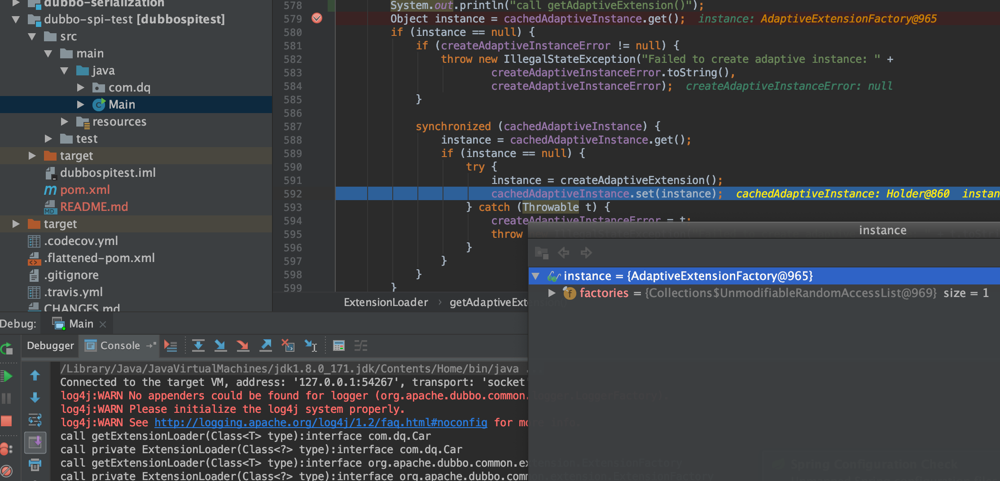
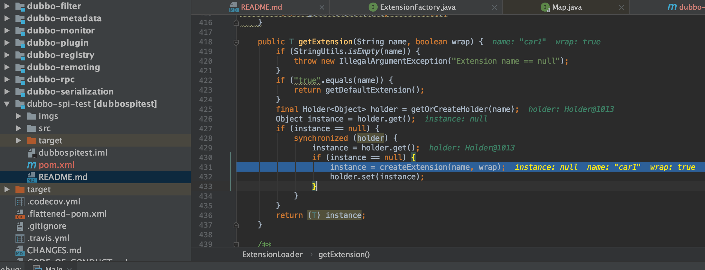
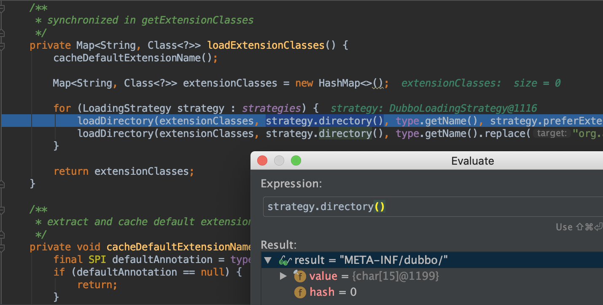
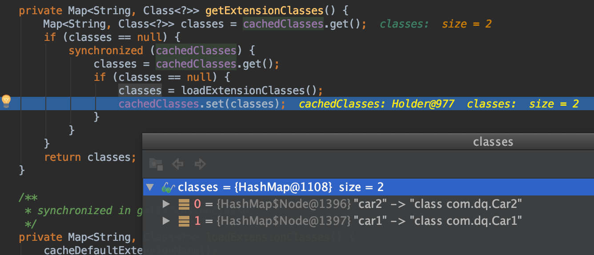
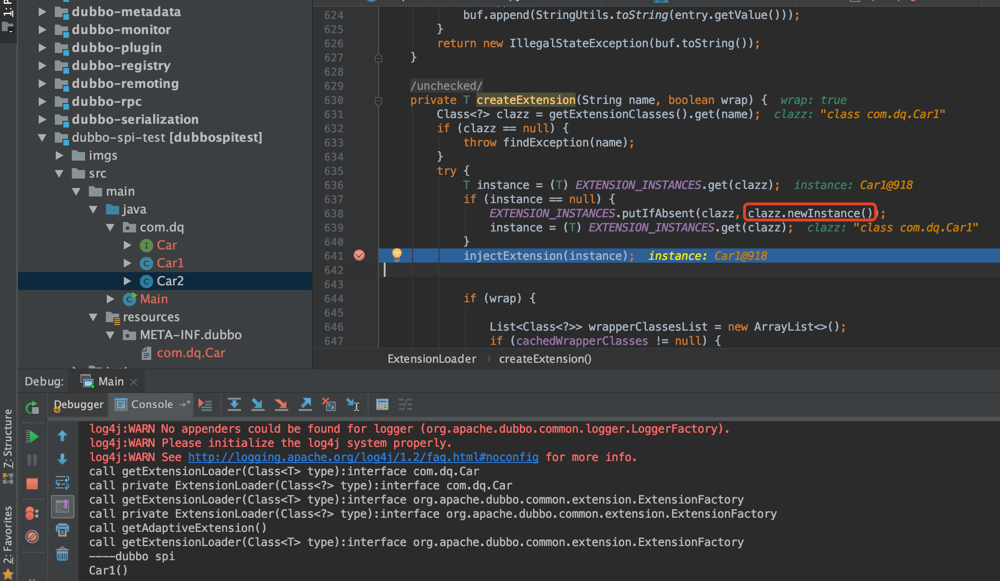
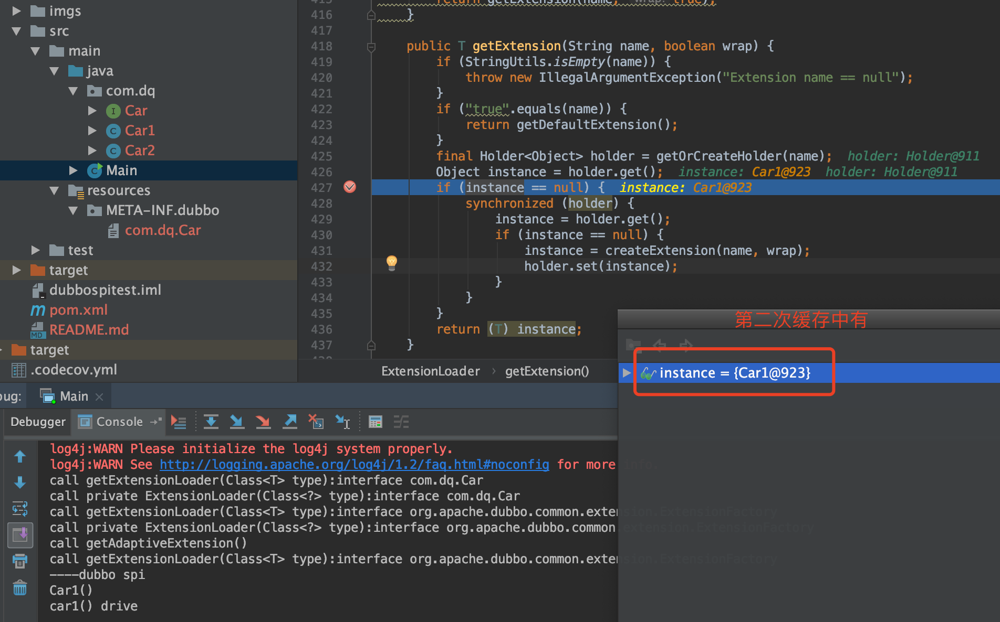

* 测试代码

```java
public static void main(String[] args) {
    ExtensionLoader<Car> extensionLoader = ExtensionLoader.getExtensionLoader(Car.class);
    System.out.println("----dubbo spi");
    Car car1 = extensionLoader.getExtension("car1");
    car1.drive();
    Car car2 = extensionLoader.getExtension("car2");
    car2.drive();
}
```

* 输出如下

```java
call getExtensionLoader(Class<T> type):interface com.dq.Car
call private ExtensionLoader(Class<?> type):interface com.dq.Car
call getExtensionLoader(Class<T> type):interface org.apache.dubbo.common.extension.ExtensionFactory
call private ExtensionLoader(Class<?> type):interface org.apache.dubbo.common.extension.ExtensionFactory
call getAdaptiveExtension()
call getExtensionLoader(Class<T> type):interface org.apache.dubbo.common.extension.ExtensionFactory
----dubbo spi
car1() drive
car2() drive
```

1. `getExtensionLoader`方法调用了三次，一次`Car.class`, 两次`ExtensionFactory.class`
2. `new ExtensionLoader<T>(type)`了两次，即实例化了 `Car.class` 的 `ExtensionLoader` 和 `ExtensionFactory.class` 的 `ExtensionLoader`
3. 调用了一次 `ExtensionFactory.class` 的 `ExtensionLoader`的`getAdaptiveExtension`方法



先`EXTENSION_LOADERS`先缓存了`ExtensionFactory.class`的`ExtensionLoader`，后缓存了`Car.class`的`ExtensionLoader`

随后获取实例，调用`ExtensionLoader`的`getExtension("car1", true)`,开始实例化对象



loadExtensionClasses使用了不同的策略,其中DubboLoading策略读取了`/META-INF/dubbo/com.dq.Car`,加载并缓存





通过反射实例化，并加到缓存中



第二次直接从缓存中取出来


